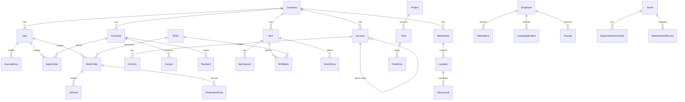

# KIRO ERP - Design Document

## Overview

KIRO ERP is a next-generation enterprise resource planning system built using modern technologies and architectural patterns. The system leverages a microservices architecture with NestJS and Fastify for the backend, PostgreSQL with DrizzleORM for data persistence, GraphQL for API communication, and Next.js for the frontend. The design emphasizes performance, scalability, security, and maintainability while providing comprehensive ERP functionality.

The system is designed to handle enterprise-scale operations with support for 10,000+ concurrent users, sub-100ms API response times, and 99.9% uptime. It incorporates advanced features like AI-powered analytics, IoT integration, real-time collaboration, and mobile-first design to provide a competitive advantage over traditional ERP systems.

## Architecture

### High-Level Architecture

```mermaid
graph TB
    subgraph "Client Layer"
        WEB[Web App - Next.js]
        MOBILE[Mobile Apps - React Native]
        ADMIN[Admin Dashboard - Next.js]
    end

    subgraph "API Gateway Layer"
        GATEWAY[GraphQL Gateway - Apollo Federation]
        AUTH[Authentication Service]
        RATE[Rate Limiting]
    end

    subgraph "Microservices Layer"
        ACCOUNTS[Accounts Service]
        SALES[Sales & CRM Service]
        INVENTORY[Inventory Service]
        MANUFACTURING[Manufacturing Service]
        PROJECTS[Projects Service]
        HR[HR Service]
        ASSETS[Assets Service]
        ANALYTICS[Analytics Service]
        WORKFLOW[Workflow Engine]
        NOTIFICATION[Notification Service]
        FILE[File Service]
        IOT[IoT Service]
    end

    subgraph "Data Layer"
        POSTGRES[(PostgreSQL - Primary DB)]
        REDIS[(Redis - Cache & Sessions)]
        ELASTICSEARCH[(Elasticsearch - Search)]
        S3[(S3 - File Storage)]
        TIMESERIES[(TimescaleDB - IoT Data)]
    end

    subgraph "External Services"
        PAYMENT[Payment Gateways]
        EMAIL[Email Services]
        SMS[SMS Services]
        AI[AI/ML Services]
        MAPS[Maps Services]
    end

    WEB --> GATEWAY
    MOBILE --> GATEWAY
    ADMIN --> GATEWAY

    GATEWAY --> AUTH
    GATEWAY --> ACCOUNTS
    GATEWAY --> SALES
    GATEWAY --> INVENTORY
    GATEWAY --> MANUFACTURING
    GATEWAY --> PROJECTS
    GATEWAY --> HR
    GATEWAY --> ASSETS
    GATEWAY --> ANALYTICS
    GATEWAY --> WORKFLOW
    GATEWAY --> NOTIFICATION
    GATEWAY --> FILE
    GATEWAY --> IOT

    ACCOUNTS --> POSTGRES
    SALES --> POSTGRES
    INVENTORY --> POSTGRES
    MANUFACTURING --> POSTGRES
    PROJECTS --> POSTGRES
    HR --> POSTGRES
    ASSETS --> POSTGRES

    ANALYTICS --> POSTGRES
    ANALYTICS --> ELASTICSEARCH
    ANALYTICS --> TIMESERIES

    WORKFLOW --> POSTGRES
    WORKFLOW --> REDIS

    NOTIFICATION --> REDIS
    NOTIFICATION --> EMAIL
    NOTIFICATION --> SMS

    FILE --> S3
    IOT --> TIMESERIES

    SALES --> PAYMENT
    ANALYTICS --> AI
    ASSETS --> MAPS
```



### Microservices Architecture

The system is built using a microservices architecture where each service is responsible for a specific business domain. This approach provides:

- **Scalability**: Each service can be scaled independently based on demand
- **Maintainability**: Services can be developed, deployed, and maintained independently
- **Technology Flexibility**: Different services can use different technologies if needed
- **Fault Isolation**: Failure in one service doesn't affect others
- **Team Autonomy**: Different teams can work on different services independently

### Technology Stack

#### Backend Technologies

- **Framework**: NestJS with Fastify adapter for high performance
- **Database**: PostgreSQL with DrizzleORM for type-safe database operations
- **API**: GraphQL with Apollo Federation for unified API gateway
- **Caching**: Redis for session management and application caching
- **Search**: Elasticsearch for full-text search and analytics
- **Message Queue**: Bull Queue with Redis for background job processing
- **File Storage**: AWS S3 compatible storage for documents and media
- **Time Series**: TimescaleDB for IoT and analytics data
- **Authentication**: JWT with refresh tokens, OAuth2, SAML 2.0
- **Monitoring**: Prometheus and Grafana for metrics and monitoring
- **Logging**: Winston with structured logging and ELK stack

#### Frontend Technologies

- **Framework**: Next.js 14+ with App Router for server-side rendering
- **UI Library**: Tailwind CSS with Headless UI and Radix UI components
- **State Management**: Zustand for global state, React Query for server state
- **Forms**: React Hook Form with Zod validation
- **Charts**: Recharts and D3.js for data visualization
- **Real-time**: GraphQL subscriptions with WebSockets
- **PWA**: Service Workers for offline capabilities
- **Testing**: Vitest and Testing Library for comprehensive testing

#### Mobile Technologies

- **Framework**: React Native with Expo for cross-platform development
- **Navigation**: React Navigation v6 for navigation management
- **State**: Shared state management with web application
- **Offline**: SQLite with sync capabilities for offline functionality
- **Push Notifications**: Expo Notifications for real-time alerts
- **Native Features**: Camera, GPS, biometric authentication integration

## Components and Interfaces

### Core Services

#### 1. Authentication Service

```typescript
interface AuthService {
  // User authentication
  login(credentials: LoginCredentials): Promise<AuthResult>;
  logout(userId: string): Promise<void>;
  refreshToken(refreshToken: string): Promise<TokenPair>;

  // Multi-factor authentication
  enableMFA(userId: string): Promise<MFASetup>;
  verifyMFA(userId: string, token: string): Promise<boolean>;

  // OAuth2 integration
  initiateOAuth(provider: OAuthProvider): Promise<OAuthUrl>;
  handleOAuthCallback(code: string, state: string): Promise<AuthResult>;

  // SAML integration
  initiateSAML(entityId: string): Promise<SAMLRequest>;
  handleSAMLResponse(response: string): Promise<AuthResult>;

  // Session management
  validateSession(token: string): Promise<User>;
  revokeSession(sessionId: string): Promise<void>;
}
```

#### 2. Accounts Service

```typescript
interface AccountsService {
  // Chart of Accounts
  createAccount(account: CreateAccountDto): Promise<Account>;
  updateAccount(id: string, updates: UpdateAccountDto): Promise<Account>;
  getAccountHierarchy(companyId: string): Promise<AccountTree>;

  // General Ledger
  createJournalEntry(entry: CreateJournalEntryDto): Promise<JournalEntry>;
  postGLEntries(entries: GLEntry[]): Promise<void>;
  getAccountBalance(accountId: string, date?: Date): Promise<Balance>;

  // Accounts Receivable
  createInvoice(invoice: CreateInvoiceDto): Promise<Invoice>;
  recordPayment(payment: CreatePaymentDto): Promise<Payment>;
  getAgingReport(customerId?: string): Promise<AgingReport>;

  // Accounts Payable
  createBill(bill: CreateBillDto): Promise<Bill>;
  schedulePayment(payment: SchedulePaymentDto): Promise<ScheduledPayment>;
  getVendorAging(vendorId?: string): Promise<AgingReport>;

  // Banking
  reconcileBank(reconciliation: BankReconciliationDto): Promise<void>;
  importBankStatement(file: File): Promise<BankTransaction[]>;

  // Financial Reporting
  generateBalanceSheet(params: ReportParams): Promise<BalanceSheet>;
  generateProfitLoss(params: ReportParams): Promise<ProfitLoss>;
  generateCashFlow(params: ReportParams): Promise<CashFlow>;
}
```

#### 3. Sales & CRM Service

```typescript
interface SalesCRMService {
  // Lead Management
  createLead(lead: CreateLeadDto): Promise<Lead>;
  scoreLead(leadId: string): Promise<LeadScore>;
  convertLead(leadId: string, conversion: LeadConversionDto): Promise<Customer>;

  // Opportunity Management
  createOpportunity(opportunity: CreateOpportunityDto): Promise<Opportunity>;
  updateStage(opportunityId: string, stage: SalesStage): Promise<Opportunity>;
  forecastSales(params: ForecastParams): Promise<SalesForecast>;

  // Customer Management
  createCustomer(customer: CreateCustomerDto): Promise<Customer>;
  updateCustomer(id: string, updates: UpdateCustomerDto): Promise<Customer>;
  getCustomerHistory(customerId: string): Promise<CustomerHistory>;

  // Sales Order Management
  createQuotation(quotation: CreateQuotationDto): Promise<Quotation>;
  convertToSalesOrder(quotationId: string): Promise<SalesOrder>;
  updateOrderStatus(orderId: string, status: OrderStatus): Promise<SalesOrder>;

  // Point of Sale
  createPOSProfile(profile: CreatePOSProfileDto): Promise<POSProfile>;
  processPOSSale(sale: POSSaleDto): Promise<POSInvoice>;
  syncOfflineTransactions(transactions: OfflineTransaction[]): Promise<void>;
}
```

#### 4. Inventory Service

```typescript
interface InventoryService {
  // Item Management
  createItem(item: CreateItemDto): Promise<Item>;
  createItemVariant(variant: CreateVariantDto): Promise<ItemVariant>;
  updateItemPricing(itemId: string, pricing: PricingDto): Promise<Item>;

  // Warehouse Management
  createWarehouse(warehouse: CreateWarehouseDto): Promise<Warehouse>;
  createLocation(location: CreateLocationDto): Promise<Location>;
  transferStock(transfer: StockTransferDto): Promise<StockTransfer>;

  // Stock Management
  createStockEntry(entry: CreateStockEntryDto): Promise<StockEntry>;
  updateStockLevel(update: StockUpdateDto): Promise<StockLevel>;
  getStockBalance(itemId: string, warehouseId?: string): Promise<StockBalance>;

  // Serial/Batch Tracking
  createSerialNumbers(serial: CreateSerialDto): Promise<SerialNumber[]>;
  trackBatch(batch: BatchTrackingDto): Promise<Batch>;
  getTraceability(
    itemId: string,
    serialNo?: string
  ): Promise<TraceabilityReport>;

  // Inventory Valuation
  calculateValuation(method: ValuationMethod): Promise<InventoryValuation>;
  revaluateStock(revaluation: RevaluationDto): Promise<void>;

  // Reorder Management
  setReorderLevels(levels: ReorderLevelDto[]): Promise<void>;
  generatePurchaseSuggestions(): Promise<PurchaseSuggestion[]>;
}
```

#### 5. Manufacturing Service

```typescript
interface ManufacturingService {
  // Bill of Materials
  createBOM(bom: CreateBOMDto): Promise<BOM>;
  updateBOMVersion(bomId: string, version: BOMVersionDto): Promise<BOM>;
  calculateBOMCost(bomId: string): Promise<BOMCost>;

  // Production Planning
  createProductionPlan(plan: CreateProductionPlanDto): Promise<ProductionPlan>;
  runMRP(params: MRPParams): Promise<MRPResult>;
  planCapacity(params: CapacityPlanningDto): Promise<CapacityPlan>;

  // Work Order Management
  createWorkOrder(workOrder: CreateWorkOrderDto): Promise<WorkOrder>;
  startProduction(workOrderId: string): Promise<WorkOrder>;
  recordProduction(production: ProductionRecordDto): Promise<ProductionEntry>;

  // Shop Floor Control
  createJobCard(jobCard: CreateJobCardDto): Promise<JobCard>;
  updateOperationStatus(
    operationId: string,
    status: OperationStatus
  ): Promise<Operation>;
  recordDowntime(downtime: DowntimeDto): Promise<DowntimeRecord>;

  // Quality Control
  createQualityInspection(
    inspection: QualityInspectionDto
  ): Promise<QualityInspection>;
  recordQualityResults(results: QualityResultDto[]): Promise<void>;
}
```

#### 6. Projects Service

```typescript
interface ProjectsService {
  // Project Management
  createProject(project: CreateProjectDto): Promise<Project>;
  updateProjectStatus(
    projectId: string,
    status: ProjectStatus
  ): Promise<Project>;
  getProjectGantt(projectId: string): Promise<GanttChart>;

  // Task Management
  createTask(task: CreateTaskDto): Promise<Task>;
  updateTaskStatus(taskId: string, status: TaskStatus): Promise<Task>;
  assignTask(taskId: string, assigneeId: string): Promise<Task>;

  // Time Tracking
  createTimesheet(timesheet: CreateTimesheetDto): Promise<Timesheet>;
  logTime(timeLog: TimeLogDto): Promise<TimeEntry>;
  approveTimesheet(timesheetId: string): Promise<Timesheet>;

  // Resource Management
  allocateResource(
    allocation: ResourceAllocationDto
  ): Promise<ResourceAllocation>;
  getResourceUtilization(resourceId: string): Promise<ResourceUtilization>;

  // Project Accounting
  createProjectBudget(budget: ProjectBudgetDto): Promise<ProjectBudget>;
  trackProjectCosts(projectId: string): Promise<ProjectCosts>;
  generateProjectInvoice(params: ProjectInvoiceDto): Promise<Invoice>;
}
```

#### 7. HR Service

```typescript
interface HRService {
  // Employee Management
  createEmployee(employee: CreateEmployeeDto): Promise<Employee>;
  updateEmployee(id: string, updates: UpdateEmployeeDto): Promise<Employee>;
  getEmployeeHierarchy(companyId: string): Promise<EmployeeTree>;

  // Attendance Management
  recordAttendance(attendance: AttendanceDto): Promise<Attendance>;
  calculateOvertime(
    employeeId: string,
    period: DateRange
  ): Promise<OvertimeCalculation>;
  generateAttendanceReport(params: ReportParams): Promise<AttendanceReport>;

  // Leave Management
  createLeaveApplication(leave: LeaveApplicationDto): Promise<LeaveApplication>;
  approveLeave(
    leaveId: string,
    approval: LeaveApprovalDto
  ): Promise<LeaveApplication>;
  calculateLeaveBalance(employeeId: string): Promise<LeaveBalance>;

  // Payroll Management
  createSalaryStructure(
    structure: SalaryStructureDto
  ): Promise<SalaryStructure>;
  processPayroll(params: PayrollProcessDto): Promise<PayrollRun>;
  generatePayslip(employeeId: string, period: PayrollPeriod): Promise<Payslip>;

  // Performance Management
  createPerformanceGoal(goal: PerformanceGoalDto): Promise<PerformanceGoal>;
  conductPerformanceReview(
    review: PerformanceReviewDto
  ): Promise<PerformanceReview>;
}
```

#### 8. Assets Service

```typescript
interface AssetsService {
  // Asset Management
  createAsset(asset: CreateAssetDto): Promise<Asset>;
  updateAssetLocation(assetId: string, location: LocationDto): Promise<Asset>;
  transferAsset(transfer: AssetTransferDto): Promise<AssetTransfer>;

  // Depreciation Management
  calculateDepreciation(
    assetId: string,
    method: DepreciationMethod
  ): Promise<DepreciationSchedule>;
  postDepreciation(entries: DepreciationEntry[]): Promise<void>;
  revalueAsset(revaluation: AssetRevaluationDto): Promise<Asset>;

  // Maintenance Management
  createMaintenanceSchedule(
    schedule: MaintenanceScheduleDto
  ): Promise<MaintenanceSchedule>;
  generateWorkOrder(scheduleId: string): Promise<MaintenanceWorkOrder>;
  recordMaintenance(
    maintenance: MaintenanceRecordDto
  ): Promise<MaintenanceRecord>;

  // Asset Tracking
  updateAssetStatus(assetId: string, status: AssetStatus): Promise<Asset>;
  getAssetHistory(assetId: string): Promise<AssetHistory>;
  generateAssetReport(params: AssetReportParams): Promise<AssetReport>;
}
```

### Data Models

#### Core Entity Relationships



#### Database Schema Design

The database schema is designed using DrizzleORM with PostgreSQL, ensuring type safety and optimal performance:

```typescript
// Core schema definitions
export const companies = pgTable("companies", {
  id: uuid("id").primaryKey().defaultRandom(),
  name: varchar("name", { length: 255 }).notNull(),
  abbreviation: varchar("abbreviation", { length: 10 }).notNull(),
  defaultCurrency: varchar("default_currency", { length: 3 }).notNull(),
  settings: jsonb("settings"),
  createdAt: timestamp("created_at").defaultNow().notNull(),
  updatedAt: timestamp("updated_at").defaultNow().notNull(),
});

export const users = pgTable("users", {
  id: uuid("id").primaryKey().defaultRandom(),
  email: varchar("email", { length: 255 }).notNull().unique(),
  passwordHash: varchar("password_hash", { length: 255 }),
  firstName: varchar("first_name", { length: 100 }),
  lastName: varchar("last_name", { length: 100 }),
  isActive: boolean("is_active").default(true),
  mfaEnabled: boolean("mfa_enabled").default(false),
  companyId: uuid("company_id")
    .references(() => companies.id)
    .notNull(),
  createdAt: timestamp("created_at").defaultNow().notNull(),
  updatedAt: timestamp("updated_at").defaultNow().notNull(),
});

export const accounts = pgTable("accounts", {
  id: uuid("id").primaryKey().defaultRandom(),
  accountCode: varchar("account_code", { length: 50 }).notNull(),
  accountName: varchar("account_name", { length: 255 }).notNull(),
  accountType: varchar("account_type", { length: 50 }).notNull(),
  parentAccountId: uuid("parent_account_id").references(() => accounts.id),
  companyId: uuid("company_id")
    .references(() => companies.id)
    .notNull(),
  currency: varchar("currency", { length: 3 }),
  isGroup: boolean("is_group").default(false),
  balance: decimal("balance", { precision: 15, scale: 2 }).default("0"),
  createdAt: timestamp("created_at").defaultNow().notNull(),
  updatedAt: timestamp("updated_at").defaultNow().notNull(),
});

// Additional tables for GL entries, customers, items, etc.
```

### GraphQL Schema Design

The GraphQL schema provides a unified API interface across all microservices:

```graphql
type Query {
  # Authentication
  me: User

  # Accounts
  accounts(
    filter: AccountFilter
    pagination: PaginationInput
  ): AccountConnection
  account(id: ID!): Account
  journalEntries(filter: JournalEntryFilter): [JournalEntry]

  # Sales & CRM
  customers(filter: CustomerFilter): CustomerConnection
  leads(filter: LeadFilter): LeadConnection
  opportunities(filter: OpportunityFilter): OpportunityConnection
  salesOrders(filter: SalesOrderFilter): SalesOrderConnection

  # Inventory
  items(filter: ItemFilter): ItemConnection
  warehouses(filter: WarehouseFilter): [Warehouse]
  stockLevels(itemId: ID, warehouseId: ID): [StockLevel]

  # Manufacturing
  boms(filter: BOMFilter): BOMConnection
  workOrders(filter: WorkOrderFilter): WorkOrderConnection
  productionPlans(filter: ProductionPlanFilter): [ProductionPlan]

  # Projects
  projects(filter: ProjectFilter): ProjectConnection
  tasks(filter: TaskFilter): TaskConnection
  timesheets(filter: TimesheetFilter): [Timesheet]

  # HR
  employees(filter: EmployeeFilter): EmployeeConnection
  attendance(filter: AttendanceFilter): [Attendance]
  payrollRuns(filter: PayrollFilter): [PayrollRun]

  # Assets
  assets(filter: AssetFilter): AssetConnection
  maintenanceSchedules(filter: MaintenanceFilter): [MaintenanceSchedule]

  # Analytics
  dashboardMetrics(dashboard: DashboardType): DashboardMetrics
  financialReports(type: ReportType, params: ReportParams): FinancialReport

  # Search
  globalSearch(query: String!, filters: SearchFilters): SearchResults
}

type Mutation {
  # Authentication
  login(input: LoginInput!): AuthPayload
  logout: Boolean
  refreshToken(token: String!): TokenPair

  # Accounts
  createAccount(input: CreateAccountInput!): Account
  createJournalEntry(input: CreateJournalEntryInput!): JournalEntry
  createInvoice(input: CreateInvoiceInput!): Invoice

  # Sales & CRM
  createLead(input: CreateLeadInput!): Lead
  createCustomer(input: CreateCustomerInput!): Customer
  createSalesOrder(input: CreateSalesOrderInput!): SalesOrder

  # Inventory
  createItem(input: CreateItemInput!): Item
  createStockEntry(input: CreateStockEntryInput!): StockEntry
  transferStock(input: StockTransferInput!): StockTransfer

  # Manufacturing
  createBOM(input: CreateBOMInput!): BOM
  createWorkOrder(input: CreateWorkOrderInput!): WorkOrder
  startProduction(workOrderId: ID!): WorkOrder

  # Projects
  createProject(input: CreateProjectInput!): Project
  createTask(input: CreateTaskInput!): Task
  logTime(input: TimeLogInput!): TimeEntry

  # HR
  createEmployee(input: CreateEmployeeInput!): Employee
  recordAttendance(input: AttendanceInput!): Attendance
  processPayroll(input: PayrollInput!): PayrollRun

  # Assets
  createAsset(input: CreateAssetInput!): Asset
  scheduleDepreciation(assetId: ID!): DepreciationSchedule
  recordMaintenance(input: MaintenanceInput!): MaintenanceRecord
}

type Subscription {
  # Real-time updates
  stockLevelChanged(itemId: ID, warehouseId: ID): StockLevel
  orderStatusChanged(orderId: ID!): OrderStatus
  taskUpdated(projectId: ID): Task
  notificationReceived(userId: ID!): Notification
  workflowStatusChanged(workflowId: ID!): WorkflowStatus
  iotDataReceived(deviceId: ID!): IoTData
}
```

## Error Handling

### Error Classification

The system implements a comprehensive error handling strategy with standardized error types:

```typescript
enum ErrorType {
  VALIDATION_ERROR = "VALIDATION_ERROR",
  AUTHENTICATION_ERROR = "AUTHENTICATION_ERROR",
  AUTHORIZATION_ERROR = "AUTHORIZATION_ERROR",
  NOT_FOUND_ERROR = "NOT_FOUND_ERROR",
  BUSINESS_LOGIC_ERROR = "BUSINESS_LOGIC_ERROR",
  EXTERNAL_SERVICE_ERROR = "EXTERNAL_SERVICE_ERROR",
  DATABASE_ERROR = "DATABASE_ERROR",
  NETWORK_ERROR = "NETWORK_ERROR",
  INTERNAL_SERVER_ERROR = "INTERNAL_SERVER_ERROR",
}

interface ErrorResponse {
  type: ErrorType;
  message: string;
  code: string;
  details?: any;
  timestamp: string;
  requestId: string;
  path: string;
}
```

### Error Handling Patterns

1. **Input Validation**: All inputs are validated using Zod schemas with detailed error messages
2. **Business Logic Errors**: Custom exceptions for business rule violations
3. **Database Errors**: Proper handling of constraint violations and connection issues
4. **External Service Errors**: Retry mechanisms and fallback strategies
5. **Global Error Handler**: Centralized error processing with logging and monitoring

### Retry and Circuit Breaker Patterns

```typescript
@Injectable()
export class CircuitBreakerService {
  private circuitBreakers = new Map<string, CircuitBreaker>();

  async executeWithCircuitBreaker<T>(
    key: string,
    operation: () => Promise<T>,
    options: CircuitBreakerOptions = {}
  ): Promise<T> {
    const circuitBreaker = this.getOrCreateCircuitBreaker(key, options);
    return circuitBreaker.execute(operation);
  }
}
```

## Testing Strategy

### Testing Pyramid

The testing strategy follows the testing pyramid approach with comprehensive coverage at all levels:

#### 1. Unit Tests (70% of tests)

- **Service Layer Tests**: Test business logic in isolation
- **Repository Tests**: Test data access patterns
- **Utility Function Tests**: Test helper functions and utilities
- **Validation Tests**: Test input validation schemas

```typescript
describe("AccountsService", () => {
  let service: AccountsService;
  let mockRepository: jest.Mocked<AccountsRepository>;

  beforeEach(async () => {
    const module = await Test.createTestingModule({
      providers: [
        AccountsService,
        { provide: AccountsRepository, useValue: mockRepository },
      ],
    }).compile();

    service = module.get<AccountsService>(AccountsService);
  });

  it("should create account with valid data", async () => {
    const accountData = { name: "Test Account", type: "Asset" };
    const expectedAccount = { id: "1", ...accountData };

    mockRepository.create.mockResolvedValue(expectedAccount);

    const result = await service.createAccount(accountData);

    expect(result).toEqual(expectedAccount);
    expect(mockRepository.create).toHaveBeenCalledWith(accountData);
  });
});
```

#### 2. Integration Tests (20% of tests)

- **API Endpoint Tests**: Test GraphQL resolvers and REST endpoints
- **Database Integration Tests**: Test database operations with real database
- **Service Integration Tests**: Test service interactions
- **External Service Integration Tests**: Test third-party integrations

```typescript
describe("Accounts GraphQL Integration", () => {
  let app: INestApplication;
  let graphqlClient: GraphQLClient;

  beforeAll(async () => {
    const moduleFixture = await Test.createTestingModule({
      imports: [AppModule],
    }).compile();

    app = moduleFixture.createNestApplication();
    await app.init();

    graphqlClient = new GraphQLClient(`http://localhost:${port}/graphql`);
  });

  it("should create account via GraphQL", async () => {
    const mutation = gql`
      mutation CreateAccount($input: CreateAccountInput!) {
        createAccount(input: $input) {
          id
          name
          type
        }
      }
    `;

    const result = await graphqlClient.request(mutation, {
      input: { name: "Test Account", type: "Asset" },
    });

    expect(result.createAccount).toMatchObject({
      name: "Test Account",
      type: "Asset",
    });
  });
});
```

#### 3. End-to-End Tests (10% of tests)

- **User Journey Tests**: Test complete user workflows
- **Cross-Service Tests**: Test interactions between multiple services
- **Performance Tests**: Test system performance under load
- **Security Tests**: Test authentication and authorization

```typescript
describe("Sales Order E2E", () => {
  it("should complete sales order workflow", async () => {
    // Create customer
    const customer = await createTestCustomer();

    // Create items
    const items = await createTestItems();

    // Create quotation
    const quotation = await createQuotation(customer.id, items);

    // Convert to sales order
    const salesOrder = await convertToSalesOrder(quotation.id);

    // Confirm order
    await confirmSalesOrder(salesOrder.id);

    // Verify stock reservation
    const stockLevels = await getStockLevels(items[0].id);
    expect(stockLevels.reserved).toBeGreaterThan(0);

    // Create delivery note
    const deliveryNote = await createDeliveryNote(salesOrder.id);

    // Create invoice
    const invoice = await createInvoice(salesOrder.id);

    // Verify accounting entries
    const glEntries = await getGLEntries(invoice.id);
    expect(glEntries).toHaveLength(2); // Debit and Credit entries
  });
});
```

### Test Data Management

```typescript
@Injectable()
export class TestDataFactory {
  async createTestCompany(overrides?: Partial<Company>): Promise<Company> {
    return this.companyRepository.create({
      name: "Test Company",
      abbreviation: "TC",
      defaultCurrency: "USD",
      ...overrides,
    });
  }

  async createTestUser(
    companyId: string,
    overrides?: Partial<User>
  ): Promise<User> {
    return this.userRepository.create({
      email: "test@example.com",
      firstName: "Test",
      lastName: "User",
      companyId,
      ...overrides,
    });
  }

  async createTestAccount(
    companyId: string,
    overrides?: Partial<Account>
  ): Promise<Account> {
    return this.accountRepository.create({
      accountCode: "TEST001",
      accountName: "Test Account",
      accountType: "Asset",
      companyId,
      ...overrides,
    });
  }
}
```

### Performance Testing

```typescript
describe("Performance Tests", () => {
  it("should handle 1000 concurrent account creations", async () => {
    const startTime = Date.now();
    const promises = Array.from({ length: 1000 }, (_, i) =>
      createAccount({ name: `Account ${i}`, type: "Asset" })
    );

    const results = await Promise.all(promises);
    const endTime = Date.now();
    const duration = endTime - startTime;

    expect(results).toHaveLength(1000);
    expect(duration).toBeLessThan(5000); // Should complete within 5 seconds
  });

  it("should maintain response time under load", async () => {
    const responseTime = await measureResponseTime(async () => {
      return getAccountBalance("test-account-id");
    });

    expect(responseTime).toBeLessThan(100); // Should respond within 100ms
  });
});
```

This comprehensive design document provides the foundation for building a modern, scalable, and maintainable ERP system that meets enterprise requirements while leveraging the latest technologies and best practices.
